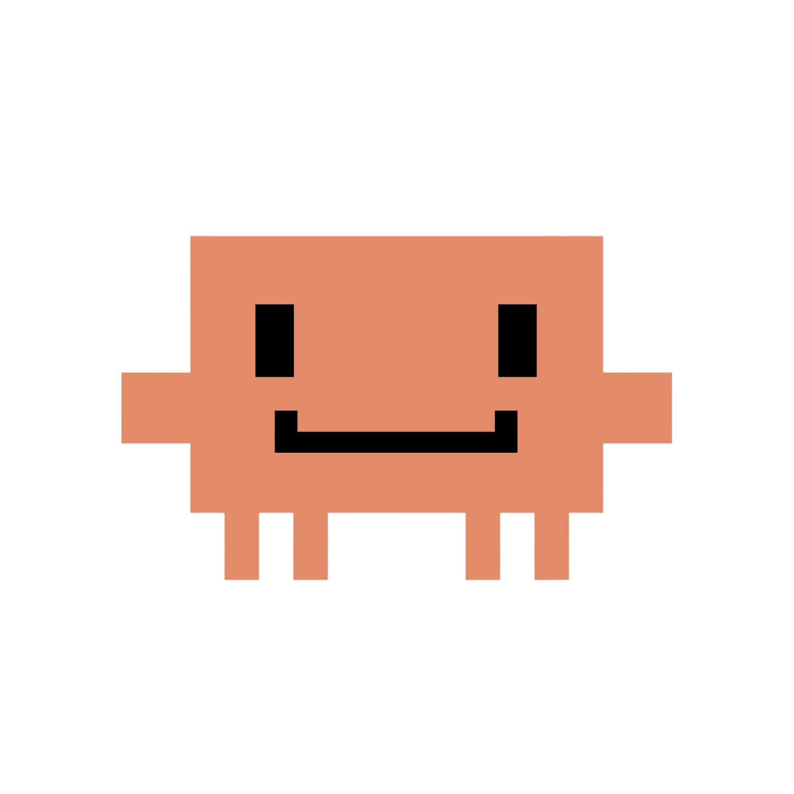

<table>
<tr>

<td valign="middle">

<pre>
██████╗ ██╗███╗  ██╗ ██████╗   ██████╗   ████╗ ██╗     ██╗      █████╗  █████╗ ███╗  ██╗
██╔══██╗██║████╗ ██║██╔════╝   ██╔══██╗██╔══██╗██║     ██║     ██╔══██╗██╔══██╗████╗ ██║
██████╔╝██║██╔██╗██║██║   ██╗  ██████╦╝███████║██║     ██║     ██║  ██║██║  ██║██╔██╗██║
██╔═══╝ ██║██║╚████║██║   ██╗  ██╔══██╗██╔══██║██║     ██║     ██║  ██║██║  ██║██║╚████║
██║     ██║██║ ╚███║╚██████╔╝  ██████╦╝██║  ██║███████╗███████╗╚█████╔╝╚█████╔╝██║ ╚███║
╚═╝     ╚═╝╚═╝  ╚══╝ ╚═════╝   ╚═════╝  ═╝  ╚═╝╚══════╝╚══════╝ ╚════╝  ╚════╝ ╚═╝  ╚══╝
</pre>

</td>

<td valign="middle">



</td>

</tr>
</table>

</div>

[](https://www.npmjs.com/package/@quantthieres/ping-balloon)
[](./LICENSE)
[](https://github.com/quantthieres/ping-claude-balloon/actions/workflows/ci.yml)
[](https://github.com/quantthieres/ping-claude-balloon/releases)
[](https://github.com/quantthieres/ping-claude-balloon)
[](https://github.com/quantthieres/ping-claude-balloon)
[](https://github.com/quantthieres/ping-claude-balloon)

> A floating desktop notification bubble for terminal coding agents - know instantly when your agent is done or needs permission.

Ping Balloon sits in the corner of your screen and appears **only when something important happens**:

| State | Color | Appearance | Behaviour |
|---|---|---|---|
| **complete** | Green | Task finished — Claude stopped | Auto-hides after 6 s |
| **permission** | Amber | Claude needs your approval | Stays visible until dismissed |
| **waiting** | Blue | Claude is idle (debug/legacy) | Auto-hides after 8 s; hidden by default from hooks |

The bubble is **hidden on startup** and between events — it only pops up when Claude finishes a task or needs permission. Clicking the bubble brings your terminal back into focus and then hides the bubble.

---

## Published Package

```bash
npm install -g @quantthieres/ping-balloon
```

📦 [npmjs.com/package/@quantthieres/ping-balloon](https://www.npmjs.com/package/@quantthieres/ping-balloon)

---

## Who is it for?

Developers who run Claude Code in a terminal while working in another window (browser, design tool, docs). Instead of alt-tabbing to check on Claude, Ping Balloon tells you what's happening at a glance.

---

## Requirements

- **Node.js** >= 18
- **macOS** (10.15+) or **Windows** (10+)
- [Claude Code](https://claude.ai/code) for hook integration (optional but recommended)

> Linux is not tested. The Electron app may work but terminal focus is not implemented.

---

## Installation

### Global install (recommended)

```bash
npm install -g @quantthieres/ping-balloon
ping-balloon start
```

Verify it's running in a second terminal:

```bash
ping-balloon health
```

### Without a global install (npx)

Use the explicit `--package` form to avoid ambiguity with other commands named `ping-balloon`:

```bash
npx --package=@quantthieres/ping-balloon ping-balloon start
npx --package=@quantthieres/ping-balloon ping-balloon health
npx --package=@quantthieres/ping-balloon ping-balloon help
```

### GitHub Release (.tgz)

Download the `.tgz` from the [Releases page](https://github.com/quantthieres/ping-claude-balloon/releases), then:

```bash
npm install -g /path/to/quantthieres-ping-balloon-0.1.0.tgz
ping-balloon start
```

### Clone and run from source

```bash
git clone https://github.com/quantthieres/ping-claude-balloon.git
cd ping-claude-balloon/agent-ping-desktop

npm install
npm run build       # generate dist/
ping-balloon start  # production mode
# or
npm run dev         # development mode (Vite + Electron, hot-reload)
```

After cloning you can also link the CLI globally:

```bash
npm link            # makes `ping-balloon` available everywhere
ping-balloon help
```

---

## Quick Start

```bash
# Terminal 1 — start the bubble
ping-balloon start

# Terminal 2 — verify it's up
ping-balloon health

# Send state changes manually
ping-balloon notify permission
ping-balloon notify waiting
ping-balloon notify complete

# Wire Claude Code hooks in your project root
ping-balloon hooks install

# Remove hooks when done
ping-balloon hooks uninstall
```

---

## CLI Commands

```
ping-balloon <command> [args]
```

| Command | Description |
|---|---|
| `dev` | Start in dev mode — Vite dev server + Electron (requires source clone) |
| `start` | Start using the production build in `dist/` |
| `health` | Check if the HTTP server is reachable |
| `notify <state>` | Send a state change to the bubble |
| `hooks install` | Wire Claude Code hooks in `.claude/settings.local.json` |
| `hooks uninstall` | Remove Ping Balloon hooks |
| `doctor` | Print a full diagnostics report |
| `help` | Show usage and examples |

### `notify` flags

```bash
ping-balloon notify complete
ping-balloon notify waiting  --message "Waiting for your input..."
ping-balloon notify permission --title "Approval needed" --message "Allow bash?" --meta "Bash"
```

### `doctor` output

```
Ping Balloon — Doctor Report

  ✓  Node.js v22.0.0
  ✓  Platform: darwin arm64
  ✓  package.json
  ✓  Electron installed
  ✓  Mascot images (3 PNG)
  ✓  Production build (dist/)
  ✓  HTTP server /health  http://127.0.0.1:47321
  ✓  .claude/settings.local.json
  ✓  Claude Code hooks  Stop + Notification → claude-hook-notify.js

All checks passed.
```

---

## HTTP API

When Ping Balloon is running it exposes a local server on `http://127.0.0.1:47321`.

### GET /health

```bash
curl http://127.0.0.1:47321/health
# → {"ok":true,"app":"agent-ping"}
```

> **Note:** `"app":"agent-ping"` is the internal server identifier (legacy name, kept for compatibility). The public product name is Ping Balloon.

### POST /notify

```bash
curl -X POST http://127.0.0.1:47321/notify \
  -H 'Content-Type: application/json' \
  -d '{"state":"complete"}'
```

| Field | Type | Required |
|---|---|---|
| `state` | `"complete"` \| `"waiting"` \| `"permission"` | ✓ |
| `title` | string | — |
| `message` | string | — |
| `meta` | string | — |

---

## Claude Code Integration

Ping Balloon hooks into Claude Code to update the bubble automatically as Claude works.

### Install hooks

```bash
# Terminal 1 — Ping Balloon must be running
ping-balloon start

# Terminal 2
ping-balloon hooks install
```

This writes to `.claude/settings.local.json` (project-scoped, git-ignored). Hooks from other tools are preserved.

### State mapping

| Claude Code event | Condition | Bubble state |
|---|---|---|
| `Stop` | always | `complete` (green, auto-hides 6 s) |
| `Notification` | message contains a permission keyword | `permission` (amber, persistent) |
| `Notification` | anything else | **skipped by default** (set `PING_BALLOON_SHOW_WAITING=1` to re-enable) |

**Permission keywords** (case-insensitive): `permission`, `allow`, `approve`, `authorize`, `grant`, `blocked`, `requires approval`, `do you want to`, `confirm`

Generic Notification events (Claude is just thinking or idle) are **suppressed** so the bubble doesn't keep flashing. Only task completion and permission requests produce a notification.

### Debug mode

```bash
AGENT_PING_HOOK_DEBUG=1 node scripts/claude-hook-notify.js Stop
cat .claude/agent-ping-hook-debug.log
```

Each hook invocation appends a JSON line with timestamp, event, payload, chosen state (or `skip`), and HTTP result.

### Remove hooks

```bash
ping-balloon hooks uninstall
```

Only Ping Balloon entries are removed. Other hooks in the same file are preserved.

---

## Environment Variables

Set these before starting Ping Balloon (`ping-balloon start`) or before running a hook.

### `PING_BALLOON_SOUND=0`

Silence all notification sounds. By default a short, discrete sound plays each time the bubble appears.

```bash
PING_BALLOON_SOUND=0 ping-balloon start
```

### `PING_BALLOON_SHOW_WAITING=1`

Re-enable the `waiting` bubble for generic Notification events. By default these are suppressed to avoid noise.

```bash
# Start Ping Balloon with waiting notifications enabled
PING_BALLOON_SHOW_WAITING=1 ping-balloon start

# Test that the hook sends waiting when the flag is set
PING_BALLOON_SHOW_WAITING=1 \
  echo '{"hook_event_name":"Notification","message":"Waiting for input"}' \
  | node scripts/claude-hook-notify.js Notification
```

> **Note:** `PING_BALLOON_SHOW_WAITING` is read by `claude-hook-notify.js` at hook-invocation time, not by the Electron app. Set it as an environment variable in your shell or in `.env` if your workflow supports it.

### `AGENT_PING_HOOK_DEBUG=1`

Append timestamped debug JSON to `.claude/agent-ping-hook-debug.log` on every hook invocation.

```bash
AGENT_PING_HOOK_DEBUG=1 node scripts/claude-hook-notify.js Stop
cat .claude/agent-ping-hook-debug.log
```

---

## Terminal Focus on Click

Clicking the notification bubble tries to bring your terminal or editor to the front.

### macOS

Apps tried in order (AppleScript `tell application X to activate`):

| Priority | App |
|---|---|
| 1 | Warp |
| 2 | iTerm2 |
| 3 | Terminal |
| 4 | Visual Studio Code |

On first run macOS may ask for Automation permission — accept it for focus to work.

### Windows

Apps tried in order (PowerShell `AppActivate` by PID):

| Priority | App |
|---|---|
| 1 | Windows Terminal |
| 2 | PowerShell (`pwsh`, `powershell`) |
| 3 | cmd |
| 4 | Visual Studio Code |

The Windows foreground lock may cause the app to only flash in the taskbar rather than fully focus.

---

## npm Scripts

| Command | Description |
|---|---|
| `npm run dev` | Start Vite + Electron in development mode |
| `npm run build` | Build the React app into `dist/` |
| `npm start` | Start Electron loading `dist/` (production) |
| `npm run doctor` | Run `ping-balloon doctor` |
| `npm run health` | Check if the server is up |
| `npm run notify:complete` | Send `complete` state |
| `npm run notify:waiting` | Send `waiting` state |
| `npm run notify:permission` | Send `permission` state |
| `npm run hooks:install` | Install Claude Code hooks |
| `npm run hooks:uninstall` | Remove Claude Code hooks |

---

## Manual Test Checklist

Use this checklist before tagging a release.

**App startup**
- [ ] `npm run build` completes without errors
- [ ] `ping-balloon start` opens the Electron process — **no bubble visible on launch**
- [ ] `ping-balloon health` returns `{"ok":true,"app":"agent-ping"}`

**Bubble states and timing**
- [ ] `ping-balloon notify complete` → green bubble appears, DONE label, **auto-hides after ~6 s**, short chime plays
- [ ] `ping-balloon notify permission` → amber bubble appears, HOLD label, **stays visible**, triple-beep plays
- [ ] `ping-balloon notify waiting` → blue bubble appears, IDLE label, **auto-hides after ~8 s**, soft pulse plays
- [ ] Dismiss button (×) hides the bubble immediately (cancels any auto-hide timer)
- [ ] Next notify event makes the bubble reappear regardless of current visibility

**Sound**
- [ ] Default: sound plays on `complete`, `permission`, `waiting`
- [ ] Theme toggle (☾/☀) produces **no sound**
- [ ] `PING_BALLOON_SOUND=0 ping-balloon start` → bubble appears but **no sound**

**Theme**
- [ ] ☾/☀ button (inside the bubble, bottom-right) toggles light/dark theme
- [ ] Clicking the theme button does **not** focus the terminal or dismiss the bubble

**Bubble click — terminal focus** (macOS)
- [ ] Clicking the bubble body focuses the active terminal app **and then hides the bubble**

**Claude Code hook filtering**
- [ ] Run: `echo '{"hook_event_name":"Stop"}' | node scripts/claude-hook-notify.js Stop` → complete bubble
- [ ] Run: `echo '{"hook_event_name":"Notification","message":"Permission required"}' | node scripts/claude-hook-notify.js Notification` → permission bubble
- [ ] Run: `echo '{"hook_event_name":"Notification","message":"Waiting for input"}' | node scripts/claude-hook-notify.js Notification` → **no bubble** (suppressed by default)
- [ ] Run: `PING_BALLOON_SHOW_WAITING=1 echo '{"hook_event_name":"Notification","message":"Waiting for input"}' | node scripts/claude-hook-notify.js Notification` → waiting bubble appears
- [ ] `ping-balloon hooks install` writes to `.claude/settings.local.json`
- [ ] Running a Claude Code prompt triggers `Stop` hook → bubble shows `complete`
- [ ] `ping-balloon hooks uninstall` removes entries without touching other hooks

**CLI edge cases**
- [ ] `ping-balloon notify invalid` → error message, exit 1
- [ ] `ping-balloon foobar` → "Unknown command", exit 1
- [ ] `ping-balloon health` when app is not running → clear error, exit 1
- [ ] `ping-balloon start` when `dist/` is missing → clear error, exit 1
- [ ] `ping-balloon doctor` reports all ✓ when everything is set up

**Package**
- [ ] `npm pack --dry-run` shows only expected files (no `src/`, `node_modules/`, `.claude/`)
- [ ] `npm pack --dry-run` version shows `0.2.0`

---

## Known Limitations

- **`ping-balloon dev`** is only available when running from the source repository (requires `src/` and the Vite toolchain). It shows a clear error if run from an installed package.
- Hook routing (`permission` vs `waiting`) depends on the text in Claude Code's Notification payload. If Claude Code changes its message format, a keyword update in `scripts/claude-hook-notify.js` may be needed.
- On `Stop`, the hook cannot distinguish a successful task from a cancelled one — always shows `complete`.
- Multiple rapid Notifications overwrite each other; the bubble shows the last state received.
- Linux is not tested. The Electron window may open but terminal focus will not work.
- The app runs on a fixed port (47321). If that port is in use, the server will fail silently.
- **Windows terminal focus** is best-effort: the foreground lock may cause the app to flash in the taskbar rather than fully focus.
- **Internal identifiers** (`"app":"agent-ping"` in the HTTP response, `agent-ping-hook-debug.log`, `AGENT_PING_HOOK_DEBUG`) are legacy names kept for compatibility and will be updated in a future release.
- The npm package `@quantthieres/ping-balloon` is published on the public registry. Install with `npm install -g @quantthieres/ping-balloon`.

---

## Development

```bash
git clone https://github.com/quantthieres/ping-claude-balloon.git
cd ping-claude-balloon/agent-ping-desktop

npm install       # installs all dependencies + devDependencies
npm run dev       # Vite hot-reload + Electron
```

### Project structure

```
agent-ping-desktop/
├── bin/
│   └── agent-ping.js            ← CLI entry point (ping-balloon command)
├── electron/
│   ├── main.js                  ← Electron main process + HTTP server
│   ├── preload.js               ← IPC bridge (contextBridge)
│   └── focus-terminal.js        ← macOS/Windows terminal focus
├── scripts/
│   ├── claude-hook-notify.js    ← Hook entry point (reads stdin, routes state)
│   ├── electron-dev.js          ← Cross-platform Electron dev launcher
│   ├── notify.js                ← HTTP helper for npm scripts
│   ├── install-claude-hooks.js
│   └── uninstall-claude-hooks.js
├── src/
│   ├── App.jsx                  ← State switcher + IPC listener
│   ├── main.jsx
│   └── components/
│       ├── BubbleNotification.jsx
│       ├── BubbleNotification.css
│       ├── state-config.js
│       └── mascots/             ← complete.png, waiting.png, permission.png
├── dist/                        ← Production build (generated)
├── package.json
├── README.md
├── CHANGELOG.md
└── LICENSE
```

### Building the package

```bash
npm run build           # build React app into dist/
npm pack                # creates quantthieres-ping-balloon-0.1.0.tgz (runs build first)
npm pack --dry-run      # preview contents without creating the file
npm publish             # publish to npm as @quantthieres/ping-balloon (requires npm login)
```

---

## License

[MIT](LICENSE) — © 2026 quantthieres
